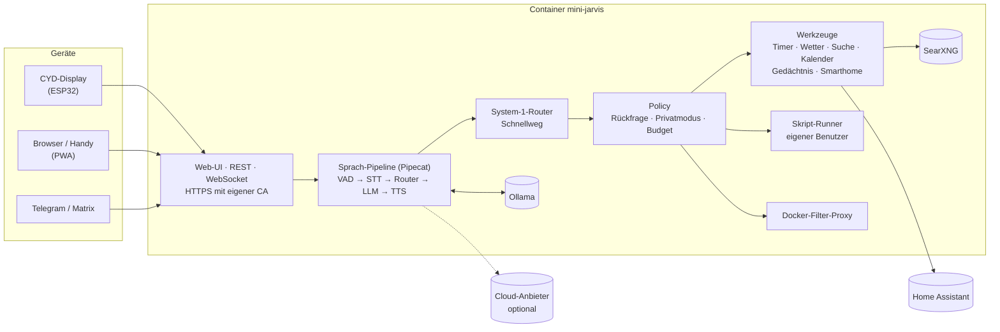

# Mini-Jarvis

[](https://github.com/hoktaar/mini-jarvis/actions/workflows/ci.yml)
[](LICENSE)
[](docs/UNRAID.md)
[](https://github.com/hoktaar/mini-jarvis/pkgs/container/mini-jarvis)

**Dein eigener, deutschsprachiger Sprachassistent – auf deinem Server, lokal als Standard, Cloud nur wenn du willst.**
Ein Container für Unraid oder Docker, dazu kleine Touch-Displays (CYD/ESP32) für jeden Raum, eine App fürs Handy
(PWA) und Chat-Bots für Telegram und Matrix.

<p align="center">
  
</p>

<p align="center"><em>Jarvis in Aktion: Wetter abfragen, einen Timer stellen, die Kaffeemaschine einschalten – alles live im Dashboard.</em></p>

---

## Inhalt

- [Was Jarvis kann](#was-jarvis-kann)
- [Screenshots](#screenshots)
- [Schnellstart](#schnellstart) – Unraid · Docker Compose
- [Hardware](#hardware) – Server · CYD-Display · Einkaufsliste · Verkabelung
- [So funktioniert Jarvis](#so-funktioniert-jarvis)
- [Sprachbefehle](#sprachbefehle)
- [Konfiguration](#konfiguration) – lokal, Cloud, gemischt
- [Sicherheit und Datenschutz](#sicherheit-und-datenschutz)
- [Entwicklung](#entwicklung)
- [Stand und Roadmap](#stand-und-roadmap)
- [Dokumentation](#dokumentation) · [Danksagungen und Lizenz](#danksagungen-und-lizenz)

## Was Jarvis kann

| Bereich | |
|---|---|
| 🎙️ **Sprache** | „Hey Jarvis“ oder Push-to-Talk, Unterbrechen jederzeit, Folgefragen ohne erneutes Wake-Word |
| ⚡ **Schnellweg** | Uhrzeit, Timer, Wecker, Erinnerungen, Wetter, Lautstärke, Privatmodus … ohne Sprachmodell, Entscheidung in Millisekunden |
| 🧰 **Werkzeuge** | Websuche (SearXNG, Brave, Tavily), Nachrichten (RSS), Kalender (CalDAV), Gedächtnis („Merk dir …“), Home Assistant, Docker-Container, eigene Skripte |
| 🧠 **Modelle** | lokal (Ollama, Whisper, Piper) **oder** Cloud: Anthropic, OpenAI, Google, Mistral, Groq, OpenRouter, DeepSeek, OpenAI-kompatibel |
| 🔊 **Stimme** | Spracherkennung: Whisper, OpenAI, Groq, Deepgram, Azure, Google, ElevenLabs · Sprachausgabe: Piper, OpenAI, ElevenLabs, Cartesia, Deepgram, Azure, Google |
| 🔁 **Ausfallsicher** | Lokal oder Cloud als Standard, der andere Weg springt bei Fehlern ein; Budget pro Tag/Monat |
| 🔒 **Sicher** | Rückfrage bei kritischen Aktionen, Schutz vor Prompt-Injection aus Webinhalten, Geräte-Tokens, HTTPS mit eigener CA, Privatmodus pro Gerät |
| 🖥️ **Oberflächen** | HUD-Dashboard (Desktop, Tablet, Handy, hell/dunkel), Verwaltung, CYD-Display mit Licht- und Musikseiten |
| 🔌 **Firmware** | CYD per USB direkt aus dem Browser flashen und einrichten, alle Updates danach per WLAN |
| 💬 **Überall** | PWA fürs Handy, Telegram- und Matrix-Bot (mit Ja/Nein-Knöpfen und Sprachnachrichten), REST-API |

## Screenshots

### Dashboard


<details>
<summary>Helles Design</summary>


</details>

### Handy (PWA)

<p align="center"></p>

### Verwaltung

| | |
|---|---|
|  |  |
| **Übersicht** – Dienste, KI-Anbieter, Antwortzeiten, HTTPS | **Firmware** – CYD per USB flashen und einrichten |
|  |  |
| **Geräte** – koppeln per QR-Code, Updates, Lautstärke | **Router** – Sätze testen, Fehler korrigieren, Auswertung |

### CYD-Display

<p align="center">
  
</p>


*Bilder mit Beispieldaten; die CYD-Bildschirme sind mit derselben Grafikbibliothek auf dem PC gerendert
(`firmware/cyd/tools/preview`).*

## Schnellstart

### Unraid

Im Unraid-Terminal:

```bash
curl -fsSL https://raw.githubusercontent.com/hoktaar/mini-jarvis/main/unraid/install.sh | bash
```

Dann **Docker → Container hinzufügen → Vorlage „mini-jarvis“ → Anwenden**. Das Skript erkennt die GPU, legt die
Ordner an und trägt die Server-IP ein. Alles Weitere – auch der Betrieb ohne GPU – steht in
**[docs/UNRAID.md](docs/UNRAID.md)**.

### Docker Compose

```bash
git clone https://github.com/hoktaar/mini-jarvis.git && cd mini-jarvis
docker compose up -d                 # ohne GPU: den deploy-Block in docker-compose.yml entfernen
docker compose exec mini-jarvis grep admin_token /config/secrets.yaml
```

Oder das fertige Image: `ghcr.io/hoktaar/mini-jarvis:latest`.

### Danach

1. `https://<server>:8443/` öffnen, Zertifikatswarnung einmal bestätigen.
2. **Verwaltung** (`/admin.html`) mit dem Admin-Token öffnen → **CA-Zertifikat** laden und auf deinen Geräten installieren.
3. `config/config.yaml`: Standort eintragen, Modelle wählen (lokal oder Cloud) – die Übersicht zeigt, was noch fehlt.
4. **Geräte → Neues Gerät**: Handy per QR-Code koppeln.
5. **Firmware → CYD per USB einrichten**: Display anschließen, WLAN eintragen, fertig.

## Hardware

### Server

| Profil | Hardware | Modelle |
|---|---|---|
| **Alles lokal** | NVIDIA-GPU ab 12 GB VRAM, 16 GB RAM | Whisper large-v3-turbo (≈ 1,5 GB VRAM) + qwen3:8b (≈ 6 GB) + Piper (CPU) |
| **Lokal, kleine GPU** | NVIDIA-GPU mit 8 GB | Whisper + qwen3:4b (≈ 3,5 GB) |
| **Ohne GPU** | beliebige x86-CPU, 8 GB RAM | Sprachmodell aus der Cloud oder von einem externen Ollama, Whisper „small“ auf der CPU oder Cloud-Spracherkennung, Piper |

Speicherbedarf: ca. 12 GB für das Image, 8–15 GB für Modelle (am besten auf SSD/Cache-Pool).
Die GPU lässt sich mit ComfyUI teilen (`gpu.comfyui_mode: auto`).

### CYD-Display (ESP32-2432S028)

Das „Cheap Yellow Display“ ist ein ESP32 mit 2,8"-Touchdisplay (320 × 240), Lautsprecher-Verstärker und
RGB-LED – ideal als Jarvis-Satellit für jeden Raum. Es braucht nur ein Mikrofon dazu.

| | |
|---|---|
| Prozessor | ESP32-WROOM-32, 240 MHz, 4 MB Flash, kein PSRAM |
| Display | 2,8" ILI9341 (Variante „CYD2USB“ mit USB-C: ST7789), resistiver Touch XPT2046 |
| Audio | Verstärker SC8002B am DAC (GPIO 26), Stecker „SPEAK“ |
| Mikrofon | INMP441 über I²S (GPIO 22/27/35) |
| Firmware | PlatformIO, LovyanGFX, WebSocket mit Token, OTA-Updates – siehe [firmware/cyd](firmware/cyd/README.md) |

#### Einkaufsliste

| Teil | Hinweis |
|---|---|
| ESP32-2432S028R („Cheap Yellow Display“) | mit einem Micro-USB = Firmware `cyd`; mit USB-C **und** Micro-USB = `cyd-st7789` |
| INMP441 I²S-Mikrofonmodul | 3,3 V, gibt es einzeln oder im 3er-Pack |
| Lautsprecher 8 Ω, 1–2 W | mit JST-1,25-mm-Stecker (passt in „SPEAK“) |
| Jumperkabel | dem CYD liegen meist Kabel für CN1/P3 bei |
| USB-Datenkabel + Netzteil 5 V / 1 A | zum Flashen ein **Datenkabel**, kein reines Ladekabel |
| optional: Gehäuse | 3D-Druckvorlagen für den CYD gibt es zahlreich |

#### Verkabelung


| INMP441 | CYD | Stecker |
|---|---|---|
| SCK | GPIO 22 | CN1 |
| WS | GPIO 27 | CN1 |
| SD | GPIO 35 | P3 |
| L/R | GND | P3 |
| VDD | 3,3 V | CN1 |
| GND | GND | CN1 |

Pinbelegung vor dem Anschließen mit der eigenen Board-Revision abgleichen. Mehr in [docs/HARDWARE.md](docs/HARDWARE.md).

#### Einrichten

1. Verwaltung über **HTTPS** in Chrome/Edge öffnen → **Firmware** → „CYD per USB einrichten“.
2. Variante wählen, Name/Raum und WLAN (2,4 GHz) eintragen, Display anschließen, *USB-Gerät wählen*.
3. Der Assistent flasht, überträgt WLAN, Server und Token und wartet, bis das Display online ist.
4. Am Display einmal die Touch-Kalibrierung durchführen (vier Pfeile antippen).

Bedienung: Reaktor **antippen** = zuhören, **halten** = Push-to-Talk; unten **Start · Licht · Musik · Einstellungen**.

## So funktioniert Jarvis



1. **Wake-Word / Push-to-Talk** – das Display streamt Audio, der Server erkennt „Hey Jarvis“ (openWakeWord).
2. **Spracherkennung** – Whisper lokal (oder ein Cloud-Dienst) macht Text daraus.
3. **System-1-Router** – ein kleiner Klassifikator erkennt einfache Anliegen („Timer zehn Minuten“) samt Angaben
   (Dauer, Uhrzeit, Ort) und erledigt sie sofort – ohne Sprachmodell.
4. **Sprachmodell** – alles andere beantwortet das LLM (lokal oder Cloud) mit passenden Werkzeugen.
5. **Policy** – kritische Aktionen (Container neu starten, Skripte) brauchen ein klares „Ja“; nach Webinhalten
   fragt Jarvis vor jeder schreibenden Aktion nach.
6. **Sprachausgabe** – Piper (oder Cloud-TTS) spricht die Antwort; Antippen unterbricht sofort.

## Sprachbefehle

| Sag … | Jarvis … |
|---|---|
| „Wie spät ist es?“ | sagt Uhrzeit und Datum |
| „Stell einen Timer auf zehn Minuten für die Nudeln“ | stellt einen benannten Timer |
| „Weck mich morgen um halb sieben“ · „Lösch den Wecker“ | stellt bzw. löscht Wecker |
| „Erinnere mich um 18 Uhr an den Müll“ | legt eine Erinnerung an |
| „Wie wird das Wetter am Samstag in München?“ | Vorhersage bis 15 Tage, beliebige Orte |
| „Was gibt es Neues?“ | liest Schlagzeilen aus RSS-Feeds |
| „Such im Internet nach …“ | Websuche (SearXNG, Brave oder Tavily) |
| „Merk dir, dass Anna gern grünen Tee trinkt“ · „Was weißt du über Anna?“ | Gedächtnis |
| „Was steht morgen im Kalender?“ · „Trag Zahnarzt am Freitag um zehn ein“ | Kalender (CalDAV) |
| „Schalte das Licht im Wohnzimmer ein“ | Home Assistant |
| „Läuft Jellyfin?“ · „Starte Jellyfin neu“ | Container-Status, Neustart nach Rückfrage |
| „Führe das Backup-Skript aus“ | freigegebene Skripte, nach Rückfrage |
| „Lauter“ · „Lautstärke 40“ · „Stopp“ | Lautstärke, Unterbrechen |
| „Privatmodus an“ | bleibt für dieses Gerät lokal |
| „Neues Thema“ · „Wiederhole das“ · „Was kannst du?“ | Gesprächssteuerung und Hilfe |
| „Denk gründlich nach: …“ · „Frag die Cloud …“ | nutzt ausdrücklich das große Cloud-Modell |

## Konfiguration

Alle Dateien liegen im Volume `/config` und werden beim ersten Start aus [`config/examples`](config/examples)
angelegt.

| Datei | Inhalt |
|---|---|
| `config.yaml` | Standort, Modelle und Anbieter, Router, Werkzeuge, MCP-Server, Home Assistant, Kalender, Push, Chat-Bots, Datenschutz |
| `secrets.yaml` | Admin-Token (wird erzeugt), API-Schlüssel, Passwörter – oder als `JARVIS_<NAME>`-Variable |
| `intents.yaml` | Schnellweg-Absichten mit Beispielsätzen – eigene ergänzen, ohne Neustart neu einlesbar |
| `scripts.yaml` | freigegebene Skripte mit Parametern und Rückfrage-Regeln |
| `whitelist.yaml` | Container, die Jarvis steuern darf |

**Alles lokal:**

```yaml
providers:
  stt: { type: whisper, model: large-v3-turbo }
  tts: { type: piper, voice: de_DE-thorsten-high }
  llm:
    primary: local
    local: { enabled: true, model: qwen3:8b }
```

**Cloud-Sprachmodell, Rest lokal (ohne GPU):**

```yaml
providers:
  stt: { type: whisper, model: small, device: cpu, compute_type: int8 }
  llm:
    primary: cloud
    local: { enabled: false }
    cloud: { enabled: true, type: anthropic, model: claude-sonnet-5-5, budget_eur_day: 1.0 }
```

**Lokal zuerst, Cloud als Rückfallebene:** `primary: local` und zusätzlich `cloud.enabled: true`.

| Rolle | Anbieter | Schlüssel in `secrets.yaml` |
|---|---|---|
| Sprachmodell | `anthropic` · `openai` · `google` · `mistral` · `groq` · `openrouter` · `deepseek` · `openai_compatible` | `<anbieter>_api_key` |
| Spracherkennung | `whisper` · `openai` · `groq` · `deepgram` · `azure` · `google` · `elevenlabs` | `deepgram_api_key`, `azure_speech_key`, `google_credentials` … |
| Sprachausgabe | `piper` · `openai` · `elevenlabs` · `cartesia` · `deepgram` · `azure` · `google` | `elevenlabs_api_key`, `cartesia_api_key` … |
| Websuche | `searxng` · `brave` · `tavily` | `brave_api_key`, `tavily_api_key` |

## Sicherheit und Datenschutz

- **Lokal als Standard** – ohne Cloud-Schlüssel verlässt nichts dein Netz. Der Privatmodus pro Gerät hält
  Sprachmodell und Werkzeuge lokal, das Wolken-Symbol zeigt Cloud-Antworten an.
- **Rückfragen** – kritische Aktionen nur nach eindeutigem „Ja“; unklare Antworten führen zum Abbruch.
- **Schutz vor Prompt-Injection** – nach Web- und Nachrichteninhalten fragt Jarvis vor jeder schreibenden Aktion.
- **Rechtetrennung** – Skripte laufen als eigener Benutzer ohne Shell; Docker nur über einen Filter-Proxy mit
  Whitelist; die Konfiguration ist für den Jarvis-Prozess schreibgeschützt.
- **Geräte** – eigenes Token pro Gerät (nur als Hash gespeichert), jederzeit sperrbar; HTTPS mit eigener CA.
- **Protokolle** – Router- und Aktionsprotokoll mit Aufbewahrungsfrist; Sätze auf Wunsch gar nicht speichern.

Details: [docs/SECURITY.md](docs/SECURITY.md).

## Entwicklung

```bash
cd server
pip install -e ".[dev,cloud,chat,extras]"
cp ../config/examples/*.yaml ../config/      # anpassen, z. B. stt/tts: none und ein Cloud-LLM
JARVIS_CONFIG_DIR=../config python -m jarvis.main        # http://localhost:8080 · https://localhost:8443
pytest && ruff check .
python -m jarvis.router.eval --trigram                   # Trefferquote des Routers
```

Firmware:

```bash
cd firmware/cyd
pio run -e cyd -e cyd-st7789                 # bauen
python tools/package.py --out dist           # Paket für Web-Flasher und OTA
cd tools/preview && ./build.sh /pfad/zu/LovyanGFX && ./preview out/   # Bildschirme auf dem PC rendern
```

```
docker/        Dockerfile, supervisord, Entrypoint, Rauchtest
unraid/        Vorlagen (mit/ohne GPU) und Installationsskript
config/        Beispielkonfiguration
server/        Jarvis-Core (Python, Pipecat, FastAPI) inkl. Web-Oberfläche (server/jarvis/web)
firmware/cyd/  CYD-Firmware (PlatformIO)
clients/       Android, Android Auto, Desktop – Pläne
docs/          Plan, Protokolle, Sicherheit, Hardware, Unraid, Bilder
scripts/       Beispiel-Skripte für den Runner
```

Die CI prüft Lint, Tests, Router-Trefferquote, baut beide Firmware-Varianten, rendert die Bildschirme, baut
das Image, startet es ohne GPU im Rauchtest und veröffentlicht es unter `ghcr.io/hoktaar/mini-jarvis`.

## Stand und Roadmap

| Teil | Stand |
|---|---|
| Server: Sprachweg, Router, Werkzeuge, Policy, Runner, Timer, Gedächtnis, Kalender, Home Assistant, Cloud-Anbieter, Telegram/Matrix | ✅ 89 Tests, Router 92,7 % auf dem Testsatz |
| Dashboard und Verwaltung | ✅ im Browser getestet (Desktop, Tablet, Handy, hell/dunkel) |
| USB-Einrichtung aus dem Browser | ✅ Ablauf mit simuliertem Gerät getestet; Flashen braucht echte Hardware |
| CYD-Firmware 0.3.0 | 🟡 kompiliert (beide Varianten), Bildschirme geprüft – **auf Hardware noch ungetestet** |
| Lokale Modelle mit GPU | 🟡 verdrahtet, auf dem Zielserver zu prüfen |
| Räume und Wake-Word-Schlichtung (mehrere Displays) | ⬜ geplant |
| Android-App, Android Auto, Desktop (Tauri) | ⬜ geplant – siehe [docs/PLAN.md](docs/PLAN.md) |

## Dokumentation

| | |
|---|---|
| [docs/UNRAID.md](docs/UNRAID.md) | Installation, Zertifikate, Profile je GPU, Updates, Backup, Fehlerbehebung |
| [docs/HARDWARE.md](docs/HARDWARE.md) | CYD, Mikrofon, Lautsprecher, Varianten |
| [firmware/cyd/README.md](firmware/cyd/README.md) | Firmware bauen, bedienen, serielles Einrichtungsprotokoll |
| [docs/PROTOCOL.md](docs/PROTOCOL.md) | WebSocket-, USB- und REST-Schnittstellen |
| [docs/SECURITY.md](docs/SECURITY.md) | Sicherheitskonzept |
| [docs/PLAN.md](docs/PLAN.md) | Architektur, Phasen, Roadmap |
| [CHANGELOG.md](CHANGELOG.md) | Änderungen |

## Danksagungen und Lizenz

Jarvis steht auf den Schultern von [Pipecat](https://github.com/pipecat-ai/pipecat),
[Ollama](https://ollama.com), [faster-whisper](https://github.com/SYSTRAN/faster-whisper),
[Piper](https://github.com/rhasspy/piper), [openWakeWord](https://github.com/dscripka/openWakeWord),
[SearXNG](https://github.com/searxng/searxng), [LovyanGFX](https://github.com/lovyan03/LovyanGFX) und
[esptool-js](https://github.com/espressif/esptool-js).

Lizenz: [MIT](LICENSE). Die CYD-Firmware enthält die Schrift Rajdhani (SIL Open Font License,
`firmware/cyd/fonts/OFL.txt`).
