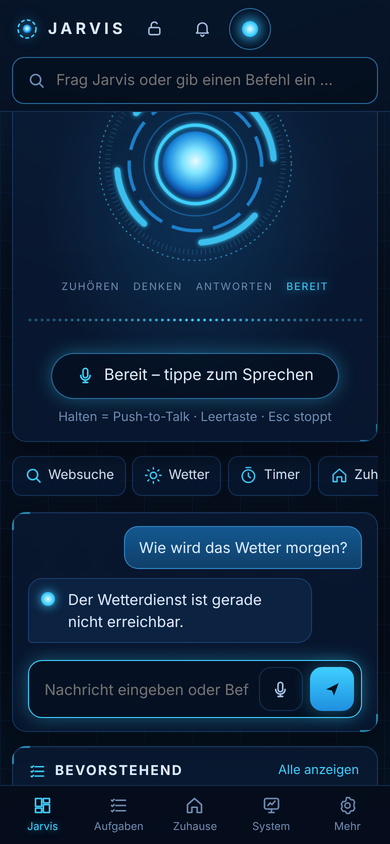

# Mini-Jarvis

Deutschsprachiger Sprachassistent für den eigenen Server – **lokal als Standard, Cloud-Dienste als Option**.
Läuft als ein Container (Unraid oder Docker) und spricht mit CYD-Displays (ESP32-2432S028), Browsern und Handys
(PWA), Telegram und Matrix.


## Was Jarvis kann

| Bereich | |
|---|---|
| Sprache | „Hey Jarvis“ oder Push-to-Talk; Whisper → Router → Sprachmodell → Piper, Unterbrechen jederzeit |
| Schnellweg | Uhrzeit, Timer, Wecker, Erinnerungen, Wetter, Lautstärke, Privatmodus … ohne Sprachmodell in Millisekunden |
| Werkzeuge | Websuche (SearXNG, Brave, Tavily), Nachrichten, Kalender (CalDAV), Gedächtnis („Merk dir …“), Home Assistant, Docker-Container, eigene Skripte |
| Modelle | lokal (Ollama, Whisper, Piper) **oder** Cloud: Anthropic, OpenAI, Google, Mistral, Groq, OpenRouter, DeepSeek, OpenAI-kompatibel; Spracherkennung/-ausgabe auch über OpenAI, Groq, Deepgram, Azure, Google, ElevenLabs, Cartesia |
| Ausfallsicherheit | Primär lokal oder Cloud, der andere Weg springt bei Fehlern ein; Budget pro Tag/Monat; Privatmodus pro Gerät |
| Sicherheit | Bestätigung für kritische Aktionen, Schutz vor Prompt-Injection aus Webinhalten, Geräte-Tokens, HTTPS mit eigener CA, getrennte Benutzer im Container – siehe [SECURITY.md](docs/SECURITY.md) |
| Oberflächen | HUD-Dashboard (Desktop, Tablet, Handy), Verwaltung, CYD-Display mit Licht-/Musik-Seiten |
| Firmware | CYD per USB direkt aus der Verwaltung flashen und einrichten, Updates danach per WLAN |

<p>
  
  
</p>


## Schnellstart

**Unraid:** Template `unraid/mini-jarvis.xml` – Anleitung in [docs/UNRAID.md](docs/UNRAID.md).

**Docker Compose:**

```bash
docker compose up -d            # baut das Image; ohne GPU den deploy-Block entfernen
# → https://<server>:8443/      Admin-Token: docker compose exec mini-jarvis grep admin_token /config/secrets.yaml
```

1. Verwaltung öffnen (`/admin.html`), CA-Zertifikat laden und auf den Geräten installieren.
2. Unter **Geräte** das Handy anlegen und den QR-Code scannen – fertig ist die PWA.
3. Unter **Firmware** ein CYD per USB einrichten (Chrome/Edge am Computer).
4. `config.yaml` anpassen: Standort, Modelle (lokal/Cloud), Home Assistant, Kalender, Telegram …
   Hinweise zu fehlenden Einstellungen zeigt die Übersicht der Verwaltung.

**Entwicklung ohne GPU:**

```bash
cd server
pip install -e ".[dev,cloud,chat,extras]"
cp ../config/examples/*.yaml ../config/      # dann anpassen (z. B. stt/tts: none, Cloud-LLM)
JARVIS_CONFIG_DIR=../config python -m jarvis.main
pytest && ruff check .
python -m jarvis.router.eval --trigram       # Trefferquote des Routers
```

## Stand

| Teil | Status |
|---|---|
| Server: Sprachweg, Router, Werkzeuge, Policy, Runner, Timer, Gedächtnis, Kalender, Home Assistant, Cloud-Anbieter, Text-Pipeline (REST, Telegram, Matrix) | ✅ 89 Tests, Router 92,7 % auf dem Testsatz |
| Dashboard und Verwaltung | ✅ im Browser getestet (Desktop, Tablet, Handy, hell/dunkel) |
| USB-Einrichtung aus der Verwaltung | ✅ Ablauf mit simuliertem Gerät getestet; Flashen selbst braucht echte Hardware |
| CYD-Firmware 0.3.0 | 🟡 kompiliert (beide Varianten), Bildschirme in der PC-Vorschau geprüft – **auf Hardware noch ungetestet** |
| Docker-Image | 🟡 CI baut das Image und macht einen Rauchtest ohne GPU; mit GPU auf dem Zielserver zu prüfen |
| Lokale Modelle (Whisper, Piper, Ollama mit GPU) | 🟡 verdrahtet, auf dem Zielserver zu prüfen |
| Android, Android Auto, Desktop | ⬜ Plan in [docs/PLAN.md](docs/PLAN.md) |

## Dokumentation

- [docs/PLAN.md](docs/PLAN.md) – Gesamtplan, Architektur, Phasen
- [docs/PROTOCOL.md](docs/PROTOCOL.md) – WebSocket-, USB- und REST-Protokolle
- [docs/SECURITY.md](docs/SECURITY.md) – Sicherheitskonzept
- [docs/UNRAID.md](docs/UNRAID.md) – Installation, Cloud-Betrieb, GPU teilen
- [docs/HARDWARE.md](docs/HARDWARE.md) – CYD verdrahten
- [firmware/cyd/README.md](firmware/cyd/README.md) – Firmware bauen, bedienen, Einrichtungsprotokoll
- [CHANGELOG.md](CHANGELOG.md)

## Struktur

```
docker/        Dockerfile, supervisord, Entrypoint, Rauchtest
unraid/        Community-Apps-Template
config/        Beispielkonfigurationen (config, secrets, intents, scripts, whitelist)
server/        Jarvis-Core (Python, Pipecat) mit Web-Oberfläche (server/jarvis/web)
firmware/cyd/  PlatformIO-Firmware für den CYD
clients/       Android, Android Auto, Desktop (Tauri) – Pläne
docs/          Plan, Protokoll, Sicherheit, Hardware, Unraid
scripts/       Beispiel-Skripte für den Runner
```

## Lizenz

MIT. Die CYD-Firmware enthält die Schrift Rajdhani (SIL Open Font License, `firmware/cyd/fonts/OFL.txt`).
