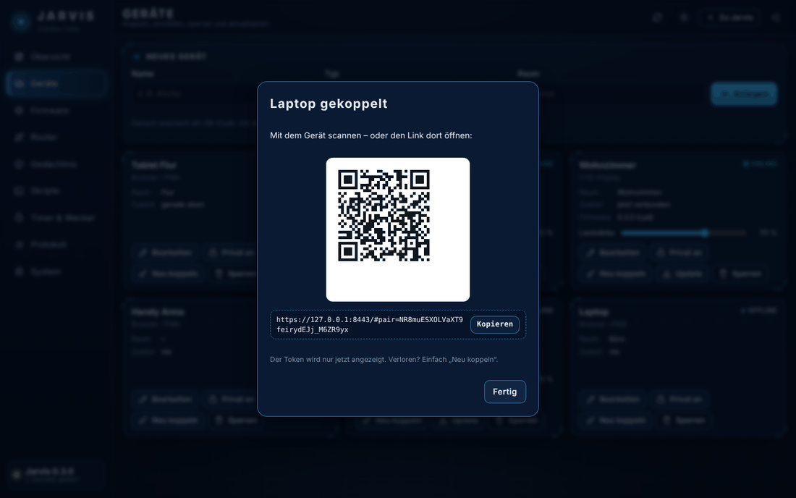

# Mini-Jarvis auf Unraid

Diese Anleitung führt von null bis zum ersten Gespräch: Container installieren, HTTPS einrichten, Geräte koppeln,
Modelle wählen – mit oder ohne GPU. Eingestellt wird alles in der Verwaltung, ohne Dateien zu bearbeiten.

> [!WARNING]
> **Work in Progress** – Mini-Jarvis ist in aktiver Entwicklung. Einiges ist nur im Test geprüft, Fehler sind zu
> erwarten und Einstellungen können sich zwischen Versionen ändern. Vor Updates `appdata/mini-jarvis/config`
> sichern und Jarvis nicht ungeschützt ins Internet stellen.

- [Voraussetzungen](#voraussetzungen)
- [Installation](#installation) – per Skript, Template-Repository oder von Hand
- [Container-Einstellungen](#container-einstellungen)
- [Erster Start](#erster-start)
- [HTTPS-Zertifikat installieren](#https-zertifikat-installieren)
- [Grundkonfiguration](#grundkonfiguration) – Standort, Modelle, Profile für jede GPU
- [Geräte koppeln](#geräte-koppeln)
- [Home Assistant, Kalender, Telegram](#home-assistant-kalender-telegram)
- [GPU mit ComfyUI teilen](#gpu-mit-comfyui-teilen)
- [Updates](#updates) · [Backup](#backup) · [Fernzugriff](#fernzugriff)
- [Fehlerbehebung](#fehlerbehebung) · [Deinstallation](#deinstallation)

## Voraussetzungen

| | Mit GPU (alles lokal) | Ohne GPU (Cloud oder externes Ollama) |
|---|---|---|
| Unraid | 6.12 oder neuer | 6.12 oder neuer |
| Plugins | **Nvidia-Driver** (Community Applications) | – |
| GPU | NVIDIA ab 8 GB VRAM, empfohlen 12 GB | – |
| RAM | 16 GB empfohlen | 8 GB |
| Speicher | ca. 12 GB Image + 8–15 GB Modelle (Cache-Pool) | ca. 12 GB Image + 1 GB |
| Netz | feste IP für den Server (Router/DHCP-Reservierung) | dito |

Das Image ist für NVIDIA gebaut, läuft aber auch ohne GPU (dann auf der CPU bzw. mit Cloud-Diensten).

## Installation

### Weg A – Installationsskript (empfohlen)

Im Unraid-Terminal (oben rechts `>_`):

```bash
curl -fsSL https://raw.githubusercontent.com/hoktaar/mini-jarvis/main/unraid/install.sh | bash
```

Das Skript

- erkennt eine NVIDIA-GPU und wählt die passende Vorlage (`mini-jarvis` bzw. `mini-jarvis-cpu`),
- legt `/mnt/user/appdata/mini-jarvis/{config,data,scripts}` und den Modellordner auf dem Cache-Pool an,
- kopiert die Beispiel-Skripte,
- trägt IP und Namen des Servers für das HTTPS-Zertifikat ein,
- prüft, ob die Ports 8080/8443 frei sind.

Danach: **Docker → Container hinzufügen → Vorlage „mini-jarvis“** (unter *Benutzervorlagen*) → *Anwenden*.

Optionen per Umgebungsvariable, z. B. ohne Cache-Pool und mit anderem Namen:

```bash
curl -fsSL https://raw.githubusercontent.com/hoktaar/mini-jarvis/main/unraid/install.sh \
  | MODELS=/mnt/user/appdata/mini-jarvis/models HOSTS=192.168.1.144,jarvis.lan bash
```

| Variable | Standard | Bedeutung |
|---|---|---|
| `GPU` | `auto` | `yes`/`no` erzwingt die Vorlage mit/ohne GPU |
| `APPDATA` | `/mnt/user/appdata/mini-jarvis` | Konfiguration, Daten, Skripte |
| `MODELS` | `/mnt/cache/appdata/mini-jarvis/models` (ohne Cache-Pool: unter `APPDATA`) | Modelle |
| `HOSTS` | IP von `br0` + `<hostname>.local` | Namen im HTTPS-Zertifikat |
| `BRANCH` | `main` | anderer Zweig des Repositorys |

### Weg B – Template-Repository

Docker → Einstellungen (erweiterte Ansicht) → **Template repositories**: `https://github.com/hoktaar/mini-jarvis`
eintragen und speichern. Danach stehen unter *Container hinzufügen* die Vorlagen `mini-jarvis` und
`mini-jarvis-cpu` bereit. Ordner und Skripte dann von Hand anlegen (siehe Weg C, Schritt 1).

### Weg C – von Hand

1. Ordner anlegen und Beispiel-Skripte kopieren:
   ```bash
   mkdir -p /mnt/user/appdata/mini-jarvis/{config,data,scripts} /mnt/cache/appdata/mini-jarvis/models
   ```
2. Vorlage herunterladen:
   ```bash
   curl -fsSL https://raw.githubusercontent.com/hoktaar/mini-jarvis/main/unraid/mini-jarvis.xml \
     -o /boot/config/plugins/dockerMan/templates-user/my-mini-jarvis.xml
   ```
   (ohne GPU: `mini-jarvis-ohne-gpu.xml` → `my-mini-jarvis-cpu.xml`)
3. Docker → Container hinzufügen → Vorlage wählen → `JARVIS_HOSTS` ausfüllen → Anwenden.

## Container-Einstellungen

| Feld | Container | Standard | Hinweis |
|---|---|---|---|
| Web-UI und Geräte (HTTP) | `8080` | 8080 | CYD/ESP32, Apps, Health-Check |
| Web-UI (HTTPS) | `8443` | 8443 | Browser mit Mikrofon, USB-Flasher |
| Server-Adressen für das Zertifikat | `JARVIS_HOSTS` | – | z. B. `192.168.1.144,tower.local` |
| Zeitzone | `TZ` | Europe/Berlin | für Wecker und Uhr |
| Konfiguration | `/config` | appdata/…/config | Einstellungen (schreibt die Verwaltung), Admin-Token, Sicherungen |
| Daten | `/data` | appdata/…/data | SQLite, Zertifikate, Firmware-Uploads |
| Modelle | `/models` | Cache-Pool | mehrere GB |
| Skripte (nur lesen) | `/scripts` | appdata/…/scripts | eigene Skripte |
| Docker-Socket | `/var/run/docker.sock` | – | optional, nur über den Filter-Proxy |
| Eingebettetes Ollama | `JARVIS_EMBEDDED_OLLAMA` | `auto` (CPU-Vorlage: `false`) | `false` bei externem Ollama |
| Eingebettetes SearXNG | `JARVIS_EMBEDDED_SEARXNG` | `auto` | lokale Websuche |
| Öffentliche Adresse | `JARVIS_PUBLIC_URL` | – | nur hinter Reverse-Proxy |
| Cloud-Schlüssel | `JARVIS_<NAME>` | – | optional, z. B. `JARVIS_ANTHROPIC_API_KEY` – einfacher: Verwaltung → Einstellungen |
| Einstellungen sperren | `JARVIS_CONFIG_READONLY` | `false` | `true`: Verwaltung zeigt die Einstellungen nur an |

Netzwerk: **Bridge** genügt. Die Displays brauchen nur die IP des Servers und Port 8080.

## Erster Start

1. Container starten und das Log öffnen (Docker → Symbol → *Logs*). Beim ersten Start werden
   Beispielkonfiguration und **Admin-Token** angelegt – der Token steht eingerahmt im Log
   („Admin-Token für die Verwaltung“). Danach lädt Jarvis die Modelle – mit GPU einige GB, das dauert.
2. Web-UI öffnen: `https://<server-ip>:8443/` – die Zertifikatswarnung einmal bestätigen.
3. **Verwaltung** öffnen (Schild-Symbol bzw. `/admin.html`) und mit dem Token anmelden. Die **Übersicht** zeigt
   den Zustand aller Dienste und Hinweise auf fehlende Einstellungen – jeder Hinweis hat einen Knopf
   **Einstellen**, der direkt zur richtigen Stelle führt.

Token nicht mehr im Log? Im Unraid-Terminal (Container `mini-jarvis-cpu` bei der Vorlage ohne GPU):
`docker exec mini-jarvis grep admin_token /config/secrets.yaml`


## HTTPS-Zertifikat installieren

Browser erlauben Mikrofon und USB nur über HTTPS. Jarvis erzeugt dafür eine eigene Zertifizierungsstelle (CA).
Einmal pro Gerät installieren, dann gibt es keine Warnungen mehr:
**Verwaltung → Übersicht → „CA-Zertifikat laden“** oder direkt `https://<server-ip>:8443/ca.crt`.

| System | So geht's |
|---|---|
| Windows | `jarvis-ca.crt` doppelklicken → *Zertifikat installieren* → *Lokaler Computer* → Speicher *Vertrauenswürdige Stammzertifizierungsstellen*. Chrome/Edge übernehmen das automatisch. |
| macOS | Datei öffnen → Schlüsselbund *System* → Zertifikat doppelklicken → *Vertrauen* → *Immer vertrauen*. |
| iPhone/iPad | In Safari öffnen → *Profil laden* → Einstellungen → *Profil geladen* → Installieren → Einstellungen → Allgemein → Info → *Zertifikatsvertrauenseinstellungen* → Jarvis einschalten. |
| Android | Einstellungen → Sicherheit → *Verschlüsselung und Anmeldedaten* → *Zertifikat installieren* → *CA-Zertifikat* (Menü je nach Hersteller). |
| Linux | `sudo cp jarvis-ca.crt /usr/local/share/ca-certificates/ && sudo update-ca-certificates` |
| Firefox | Einstellungen → Datenschutz & Sicherheit → Zertifikate → *Importieren* → „Websites identifizieren“ |

Ändert sich die IP oder der Name des Servers, `JARVIS_HOSTS` anpassen und den Container neu starten – das
Serverzertifikat wird dann neu ausgestellt, die CA bleibt gleich.

## Grundkonfiguration

Alles unter **Verwaltung → Einstellungen** – jede Eingabe wird vor dem Speichern geprüft. Nach dem Speichern
erscheint oben **Jetzt neu starten**: Jarvis startet in wenigen Sekunden neu, die Geräte verbinden sich von selbst
wieder. Ein Neustart des ganzen Containers ist nur nötig, wenn die Verwaltung das ausdrücklich meldet (z. B. beim
Wechsel zwischen eingebautem und externem Ollama).


**Zuerst:** **Allgemein → Ort suchen** – füllt Koordinaten und Zeitzone für Wetter und Wecker aus.

### Profile je nach Hardware

Unter **Sprachmodell** und **Sprache**:

| Hardware | Sprachmodell | Spracherkennung · Sprachausgabe |
|---|---|---|
| **12 GB VRAM oder mehr** – alles lokal (Standard) | *Lokal zuerst*, Ollama *Eingebaut*, Modell `qwen3:8b` | Whisper `large-v3-turbo` auf der Grafikkarte · Piper |
| **8 GB VRAM** | wie oben, Modell `qwen3:4b` (schneller, etwas weniger klug) | wie oben |
| **Ohne GPU** | *Cloud zuerst*, *Lokales Modell nutzen* aus, Anbieter z. B. Anthropic mit Schlüssel | Whisper `small` auf dem Prozessor (oder Deepgram/OpenAI) · Piper |
| **Externes Ollama** (anderer Rechner) | *Eigener Ollama-Server*, Adresse `http://192.168.1.50:11434/v1` | wie oben |
| **Lokal mit Rückfallebene** | *Lokal zuerst* + Cloud-Modell mit *Bei Ausfall einspringen* und Budget pro Tag/Monat | wie oben |

Das gewählte Ollama-Modell zeigt die Verwaltung mit Größe an; fehlt es, lädt **Jetzt herunterladen** es direkt.
Schlüssel trägst du direkt beim Anbieter ein (Werte werden nie wieder angezeigt). Der **Privatmodus** pro Gerät
hält Sprachmodell und Werkzeuge lokal.

## Geräte koppeln

| Gerät | So geht's |
|---|---|
| Handy/Tablet/PC (PWA) | Verwaltung → Geräte → *Neues Gerät*, Typ „Browser / Handy“ → QR-Code scannen. Im Browser „Zum Startbildschirm hinzufügen“. |
| CYD-Display | Verwaltung → **Firmware** → *CYD per USB einrichten* (Chrome/Edge am PC, über HTTPS). Details in [HARDWARE.md](HARDWARE.md). |
| Telegram | Bot bei @BotFather anlegen → Einstellungen → **Benachrichtigungen** → Telegram: Bot-Token und eigene Nutzer-ID eintragen. |
| Matrix | Bot-Konto anlegen → Einstellungen → **Benachrichtigungen** → Matrix: Homeserver, Konto und Passwort. |



## Home Assistant, Kalender, Telegram

**Einstellungen → Smart Home:**

1. *Home Assistant verbinden* einschalten, Adresse eintragen (z. B. `http://192.168.1.20:8123`).
2. Langzeit-Token einfügen (Home Assistant → Profil → Sicherheit → *Langlebige Zugriffstokens*).
3. **Verbindung testen & Geräte laden** – dann die Geräte ankreuzen, die im Dashboard und auf dem CYD erscheinen
   sollen.
4. Für Sprachsteuerung („Mach das Licht im Wohnzimmer an“): in Home Assistant die Integration
   *Model Context Protocol Server* hinzufügen und in Jarvis *Geräte per Sprache steuern* einschalten.


**Einstellungen → Kalender:** CalDAV-Adresse (Nextcloud: `https://cloud.example.lan/remote.php/dav`), Benutzer und
App-Passwort. **Einstellungen → Benachrichtigungen:** Push über ntfy, Telegram und Matrix.

## GPU mit ComfyUI teilen

**Einstellungen → Werkzeuge → Grafikkarte teilen:** *Automatisch, solange ComfyUI läuft* erkennt einen laufenden
ComfyUI-Container (Docker-Socket nötig) und gibt den Grafikspeicher kurz nach einer Antwort frei; *Immer* macht das
dauerhaft. Whisper weicht dann auf die CPU aus.

**Docker-Container steuern** („Starte Jellyfin neu“): unter **Werkzeuge → Docker-Container** freigeben und je
Container ankreuzen, was erlaubt ist (Status, Starten, Stoppen, Neu starten). Die Freigabe wirkt sofort.

## Updates

- **Jarvis:** Docker → *Nach Updates suchen* → *Aktualisieren*. Konfiguration und Daten bleiben erhalten.
- **CYD-Firmware:** Das Image bringt die passende Firmware mit. Verwaltung → Geräte → *Update* – oder
  automatisch (Verwaltung → Firmware → *Automatisch aktualisieren*). Die Displays laden die Firmware per WLAN, prüfen die MD5-Summe
  und starten neu.

## Backup

Sichern: `/mnt/user/appdata/mini-jarvis/config` und `…/data` (z. B. mit dem Plugin *Appdata Backup*).
Zusätzlich legt die Verwaltung vor jeder Änderung eine Kopie der betroffenen Datei unter `config/backups/` ab
(die letzten 20 je Datei).
Die Modelle lassen sich jederzeit neu laden und müssen nicht gesichert werden.

## Fernzugriff

Keinen Port ins Internet freigeben. Stattdessen Unraid → Einstellungen → **VPN-Manager** (WireGuard), Tunnel
„Fernzugriff auf LAN“ anlegen und das Handy damit verbinden – die PWA funktioniert dann auch unterwegs.

## Fehlerbehebung

| Problem | Lösung |
|---|---|
| `could not select device driver "nvidia"` | Plugin *Nvidia-Driver* installieren und Docker neu starten – oder die Vorlage ohne GPU nutzen. |
| Image lässt sich nicht laden (`unauthorized`) | Paket auf GitHub öffentlich machen: Profil → Packages → mini-jarvis → Package settings → *Change visibility* → Public. |
| Seite zeigt lange „Jarvis startet …“ | Modelle werden geladen – Container-Log ansehen. |
| Mikrofon geht im Browser nicht | Über `https://…:8443` öffnen und das CA-Zertifikat installieren. |
| USB-Flasher: „USB nicht verfügbar“ | Chrome, Edge oder Opera am Computer und HTTPS nötig. Unter Windows/macOS ggf. den CH340-Treiber installieren. |
| CYD findet den Server nicht | Feste IP statt `.local`-Namen verwenden, Port 8080 erreichbar? Der ESP32 kann nur 2,4-GHz-WLAN. |
| Antworten sind langsam | Verwaltung → Übersicht → *Antwortzeiten*. Ohne GPU läuft Whisper auf der CPU – kleineres Modell oder Cloud-STT wählen. |
| „Ollama FEHLER“ in der Übersicht | Modell lädt noch oder passt nicht in den Grafikspeicher – kleineres Modell wählen. |
| Container-Steuerung geht nicht | Docker-Socket in der Vorlage eintragen und den Container unter Einstellungen → Werkzeuge freigeben. |
| Einstellungen lassen sich nicht speichern | Steht `JARVIS_CONFIG_READONLY=true` in der Vorlage? Sonst den Container einmal neu starten – der Start setzt die Rechte von `/config`. |
| Nach einer Änderung startet Jarvis nicht mehr | Im Log nachsehen; die vorige Datei liegt unter `config/backups/` und lässt sich zurückkopieren. |
| Admin-Token vergessen | `docker exec mini-jarvis grep admin_token /config/secrets.yaml` – danach unter System einen neuen erzeugen. |

Mehr Details zeigt das Log: Docker → Symbol → *Logs* oder `docker logs -f mini-jarvis`.

## Deinstallation

Container entfernen (Docker → Symbol → *Entfernen*, Häkchen bei *Image entfernen*), dann

```bash
rm -rf /mnt/user/appdata/mini-jarvis /mnt/cache/appdata/mini-jarvis
rm -f /boot/config/plugins/dockerMan/templates-user/my-mini-jarvis*.xml
```
